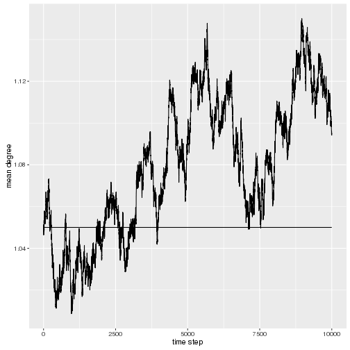

BARS Transmission Model: Chicago 
========================================================
-- Aditya, Nikki, Nick, and Jonathan 

Chicago model: steady partnerships with degree distribution, partnership duration, density


```r
rm(list=ls())
## libraries
suppressPackageStartupMessages(library(network))
suppressPackageStartupMessages(library(ergm))
suppressPackageStartupMessages(library(ggplot2))
```
and read in the various datasets that are generated:


```r
## data
net <- readRDS("../../Release/output/network_10000_9.RDS") #network at the end

biom_data <- read.csv("../../Release/output/biomarker_log_10.csv")
counts_data <- read.csv("../../Release/output/counts_10.csv")
inf_event_data <- read.csv("../../Release/output/infection_events_10.csv")
death_data <- read.csv("../../Release/output/death_events_10.csv")
partnership_event_data <- read.csv("../../Release/output/partnership_events_10.csv")
```
These datasets include the sexual network at the 10,000th (i.e. last) time step, biomarker data with detailed trajectories, infection, death and partnership events, and counts of various quantities at each time step.

# Results
## Demography
We first compute the annual growth rate.  


```r
  final.vcount <- network.size(net)
  init.vcount <- 5000
  
  annual.growth.rate <- (((final.vcount)/init.vcount)^(1/(10e3/365))-1)*100 #log scale
```
The final population size is 6666, corresponding to a growth rate of 
1.06%. (The rate of entry of new individuals is a free parameter, and will be adjusted to reflect data form the three cities). 

The age distribution at the end of the simulation is below.


```r
age <- net%v%"age"
plot(
  qplot(age, geom="histogram", binwidth=5, 
       col=I("red"), 
       alpha=I(.2))
  )
```


## Prevalence
   The overall prevalence was 
   
   ```r
   infected <- which(net %v% "inf.status" == 1)
   prev <- length(infected)/final.vcount*100
   prev
   ```
   
   ```
   ## [1] 3.045305
   ```
  about 3%.  The prevalence over time is shown below.
  
   
   ```r
   counts_data <- counts_data[-1,]
   ggplot(counts_data/365, aes(x=time, y=(vertex_count-uninfected)/vertex_count))+
         geom_line()+
         scale_y_continuous(limits=c(0,1))+
         ylab("Prevalence")+
         xlab("Time (years)")
   ```
   
   
   
## Incidence
   

  
  The mean annual incidence is 0.19%, and the annual incidence rates over the course of the simulation are shown above.


  
  
## Sexual Networks
The momentary distribution of the number of partnerships is


```r
degree_dist <- degreedist(net)
```

```
## degree0 degree1 degree2 degree3 
##    4000    2549     112       5
```

```r
barplot(degree_dist/sum(degree_dist), ylim=c(0, 0.5))
```



We see that about 35.3% of the nodes have 1 partner (the target was 36%).


   
## ART metrics

The ART initiation portion was simplified so that all infected's initate ART 1 year after seroconversion. At presetnt, the proportion of the infected on ART was


```r
  on.art <- which(net%v%"art.status" == 1)
  length(on.art)
```

[1] 202

```r
  length(on.art)/length(infected)
```

[1] 0.9950739

1. The total proportion of all people in the population who were on ART is 3.03%.

## Biomarkers

Example CD4 and viral load trajectories for one person are below.


```r
   uniq_biom_pid <- unique(biom_data$p_id)
   new <- biom_data[biom_data$p_id == uniq_biom_pid[1],]

   par(mfrow=c(2,1))
   plot(x=new$tick, y=new$cd4_count, type="l", 
        ylab="CD4 count", xlab="Days after start of simulation")
   plot(x=new$tick, y=new$viral_load, type="l",
        ylab="Viral load", xlab="Days after start of simulation")
```


We see that this person's CD4 count and viral loads remain flat until timetep &infin;, at which time he gets infected. His CD4 count starts to decline linearly, and his viral load undergoes the specified trajectory (i.e. quick initial rise during acute infection, decline to a stable state during chronic infection). At time 
&infin;, he goes on ART, and correspondingly, his CD4 count starts to rise, and viral load starts to decline. At time 5196, he leaves the simulation on account of his death.

# Conclusion
As we add realistic empirical parameters for various remaining portions, in particular the behavior and ART/PrEP modules, our model will become more finely calibrated.
