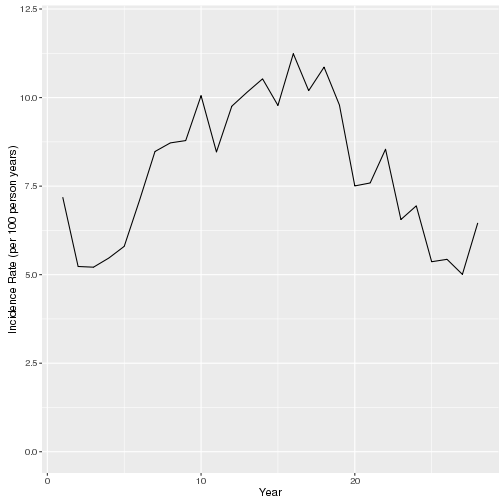
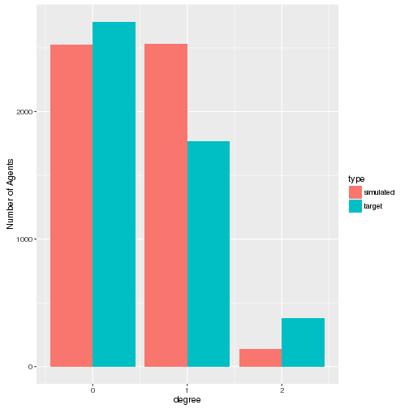

BARS Transmission Model: Preliminary Analysis of Simulated Data  
========================================================
-- Aditya Khanna, Nick Collier and Jonathan Ozik

# Introduction
We have a working model (!). Working in the sense that most of the pieces we discussed are in the model (think: procedure modules that we discussed at th retreate), some need to be added (a second type of partnership), and calibration is in progress. Which means the prevalence and incidience outputs are not quite right, but once we tune the model, they will be. 

# Main Methods
## Overview
We simulated the transmission model over approximately 30 years, in daily timesteps. The population consisted of 5000 MSM at the start,  and grew slowly. About 10% of the initial population was HIV positive, and new infections were transmitted across serodiscordant partnerships consistent with the viral load of the infected partner. These data apply to the "burnin" phase, which we discussed at the retreat.

## Demographic Charateristics 
At the start, men were uniformly distribuetd between 16 and 65 years of age (will be changed to match empirical age-distribution data). Deaths occured on account of age (at 65 years), and infection (based on CD4 counts for uninfected persons). New men entered the population at a rate (Poisson distribuetd with constant mean value), set to achieve a gently growing population (empirical rate will be matched for each of the three cities).

## Sexual Network Characteristics
Each person contained one sexual partner on average. The sexual network structure was simple for now arbitrarility set so that the number of individuals with 1 partner was 36%), yet required a "dyadic dependent" estimation model. The average length of each partnership was 100 days.

## Biomarkers
CD4 and viral load trajectories were simulated for each person in the population. CD4 was a determinant of mortality, and viral load for infectivity. 

## ART and PrEP
Our assumption was that about 60% of individuals will be able to access ART, and will initiate it 365 days after infection. ART led to viral load suppression in about 4 months and decreased the infectivity of persons over that time frame, and resulted in recovery of CD4 counts.

PrEP wasn't included in this version, but will be in subsequent model iterations.  

## Infection Transmission
Infection was transmitted across serodiscordant partnerships, with probabilities contingent upon the viral load of infected individuals.

## Computer Code
Our computer programs combine agent-based modeling tools from the Repast HPC platform with dynamic network modeling tools in the statnet package, and are available [here](https://github.com/khanna7/BARS). This dataset was generated in about two hours. 

## Analysis
We start by loading appropriate packages to conduct our analysis


```r
rm(list=ls())
## libraries
suppressPackageStartupMessages(library(network))
suppressPackageStartupMessages(library(ergm))
suppressPackageStartupMessages(library(ggplot2))
```
and read in the various datasets that are generated:


```r
## data
net <- readRDS("../../Release/output/network_10000_7.RDS") #network at the end

biom_data <- read.csv("../../Release/output/biomarker_log_9.csv")
counts_data <- read.csv("../../Release/output/counts_9.csv")
inf_event_data <- read.csv("../../Release/output/infection_events_9.csv")
death_data <- read.csv("../../Release/output/death_events_9.csv")
partnership_event_data <- read.csv("../../Release/output/partnership_events_9.csv")
```
These datasets include the sexual network at the 10,000th (i.e. last) time step, biomarker data with detailed trajectories, infection, death and partnership events, and counts of various quantities at each time step.

# Results
## Demography
We first compute the annual growth rate.  


```r
  final.vcount <- network.size(net)
  init.vcount <- 5000
  
  annual.growth.rate <- (((final.vcount)/init.vcount)^(1/(10e3/365))-1)*100 #log scale
```
The final population size is 5669, corresponding to a growth rate of 
0.46%. (The rate of entry of new individuals is a free parameter, and will be adjusted to reflect data form the three cities). 

The age distribution at the end of the simulation is below.


```r
age <- net%v%"age"
plot(
  qplot(age, geom="histogram", binwidth=5, 
       col=I("red"), 
       alpha=I(.2))
  )
```


## Prevalence
   The overall prevalence was 
   
   ```r
   infected <- which(net %v% "inf.status" == 1)
   prev <- length(infected)/final.vcount*100
   prev
   ```
   
   ```
   ## [1] 37.29053
   ```
  about 37.3%.  The prevalence over time is shown below.
  
   
   ```r
   counts_data <- counts_data[-1,]
   ggplot(counts_data/365, aes(x=time, y=(vertex_count-uninfected)/vertex_count))+
         geom_line()+
         scale_y_continuous(limits=c(0,1))+
         ylab("Prevalence")+
         xlab("Time (years)")
   ```
   
   
   
## Incidence
   

  
  The mean annual incidence is 3.88%, and the annual incidence rates over the course of the simulation are shown above.


  
  
## Sexual Networks
The momentary distribution of the number of partnerships is


```r
degree_dist <- degreedist(net)
```

```
## degree0 degree1 degree2 degree3 degree4 degree5 degree6 
##    2422    2022     863     288      62      10       2
```

```r
barplot(degree_dist/sum(degree_dist), ylim=c(0, 0.5))
```


We see that about 35.3% of the nodes have 1 partner (the target was 36%).


   
## ART metrics

The ART initiation portion was simplified so that all infected's initate ART 1 year after seroconversion. At presetnt, the proportion of the infected on ART was


```r
  on.art <- which(net%v%"art.status" == 1)
  length(on.art)
```

[1] 1679

```r
  length(on.art)/length(infected)
```

[1] 0.7942289

0.79. The total proportion of all people in the population who were on ART is 29.62%.

## Biomarkers

Example CD4 and viral load trajectories for one person are below.


```r
   uniq_biom_pid <- unique(biom_data$p_id)
   new <- biom_data[biom_data$p_id == uniq_biom_pid[1],]

   par(mfrow=c(2,1))
   plot(x=new$tick, y=new$cd4_count, type="l", 
        ylab="CD4 count", xlab="Days after start of simulation")
   plot(x=new$tick, y=new$viral_load, type="l",
        ylab="Viral load", xlab="Days after start of simulation")
```



We see that this person's CD4 count and viral loads remain flat until timetep &infin;, at which time he gets infected. His CD4 count starts to decline linearly, and his viral load undergoes the specified trajectory (i.e. quick initial rise during acute infection, decline to a stable state during chronic infection). At time 
&infin;, he goes on ART, and correspondingly, his CD4 count starts to rise, and viral load starts to decline. At time 8103, he leaves the simulation on account of his death.

# Conclusion
As we add realistic empirical parameters for various remaining portions, in particular the behavior and ART/PrEP modules, our model will become more finely calibrated.

## Prev
         
         ```r
           plot(counts_data$time, 
               (counts_data$vertex_count-counts_data$uninfected)/counts_data$vertex_count)
         ```
         
         
